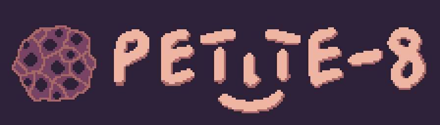

# PETITE-8

## About
PETITE-8 is a BASIC driven fantasy console, it's size is only 10KB, and you can build your standalone games with it.

Current version is `Beta 0.2`.

Inspired by
- Dartmouth BASIC
- cel7 by rxi
- REST-6 by Lunaryss

License: Public Domain, no warranty given, use at your own risk

### Specs
Here are specs of the FC:
- Screen: 48x32 pixels, 30fps, 4 colors (RUSTIC-GB palette)
- RAM: 256 bytes
- ROM: 4096 bytes of code
- Language: First-generation BASIC dialect - [Petite BASIC](https://github.com/lunar-abyss/PetiteBASIC)
- Input: 6 keys - arrow keys, Z and X
- Sound: Not implemented yet

### Features
Here are special features of the FC:
- Small size, the FC is only 10KB
- Easy to create standalone builds
- Open source, simple to port
- Simple to create game with BASIC

<!-- Should it have a compressed version?
### Two Versions
Two versions of the FC are in the `bin` folder, here is why:
1. `PETITE-8.exe`: this version is not compressed, and shouldn't have problems with antimalwares.
2. `PETITE-8-C.exe`: this version is compressed with upx tool and it might have problems with antimalvare. Be careful. -->

### Running the program
Here is an easy way to run your program:
1. Download the repository from GitHub (or only the `/bin` folder).
2. Open `/bin` folder.
3. Create a new file named `game.pb`.
4. Just run the executable `PETITE-8.exe` (it always looks for `game.pb` file).
5. To test, you can use any file from the `/bin/examples` folder (don't forget to rename it to `game.pb`).

### Building the project
Use `build.ps1` tool. More on that topic later.

### Future Of The Project
The project is still in development, and there will be a lot of new features and improvements.
You will have the ability to build your own games on any version you want.

## Documentation
Make sure to check the [Petite BASIC](https://github.com/lunar-abyss/PetiteBASIC) documentation (in `README.md file`) first.
There are not much changes from the original Petite BASIC:
- Removed `print` and `read` commands
- Added commands from the table below
- Added predefined variables for input

| Command | Arguments | Example | Description |
| :-----: | --------- | ------- | ----------- |
| `frame` | - | `frame` | Pauses execution of a script and waits for a frame to be drawn |
| `rect` | `x, y, w, h, color` | `rect 0, 0, 48, 32, 0` | Draws a rectangle on screen with specified position, size and color. Color can be only from 0 to 3 |
| `bitmap` | `index: data` | `bitmap 0: 1111 1001 1001 1111` | Registers a bitmap with specified index, and data |
| `sprite` | `index, x, y, color` | `sprite 0, 10, 10, 3` | Draws a bitmap at specified position and color. If bitmap's length is 16, then 4x4 sprite will be drawn, if bitmap's length is 25, then 5x5 | 

For the input there are predefined and automaticly updated variables:
- `keyl`: Arrow Left
- `keyr`: Arrow Right
- `keyu`: Arrow Up
- `keyd`: Arrow Down
- `keyz`: Z
- `keyx`: X

Pressed is represented by `1`, not pressed by `0`.

## Build Tool
PETITE-8 comes with a build tool, which is `build.ps1` located in the bin folder.
To run it use command `powershell .\build.ps1 <your-flags here>` in `bin` folder. Example: `powershell .\build.ps1 -o mygame.exe -c`.
It's a simple windows powershell script, which creates a new `.exe` file, your project built. You can use the `.exe` standalone, no libs, no source.

By default if you run it without any parameters, it will try to find a file named `game.pb` and build it without compression.

Here are all flags you can pass through the command line:
- `<src>`: source file to build, defaults to `game.pb`
- `-o <out>`: output file name with extension, defaults to `game.exe`
- `-c`: compress the source code (usually twice smaller), default - no
- `-crem`: save comments in the build, default - no
- `-r`: run after build, default -no

## Sample Program
Here is the simple program, to test the FC.
```cs
let x: 0
loop:
  let x: x + 1
  rect 0, 0, 48, 32, 0
  rect x, 0, 1,  1,  3
  frame
  goto loop
```
You should see a pixel running from the left top, to the right.
For more examples, check the `/bin/examples` folder.

## Building The Source
You're probably wan't to build the project from source, so here is how to do it.
1. Download the repository from github.
2. Run `build.ps1` file with powershell (`powershell .\\build.ps1`).
3. Enjoy the result! Or may be not. Any way, all build flags and stuff are in the `build.ps1` file.

## Porting
PETITE-8 works with [miowin](https://github.com/lunar-abyss/miowin) library, which is a minimal window library for Windows only.
But if you want to port the FC, there is a simple way.

There is only file you have to work with: `petite-8.c`, the only beginning of the file.
The main thing you need is to reimplement (change) the macros to make all work with your platform.
So here is a list of definitions you'll need to change:
```c
// key constants, they are passed to key_press() function
#define KEY_LEFT
#define KEY_RIGHT
#define KEY_UP
#define KEY_DOWN
#define KEY_Z
#define KEY_X

// macros to implement (just change it to the correct functions for your platform)
#define win_init()             // create a 48x32 30 fps window
#define win_update()           // update the window
#define win_kill()             // destroy the window
#define win_quit               // variable to  check if the window is running
#define win_pixel(x, y, color) // set a pixel on screen, pixels represented by integers in format 0x00RRGGBB, color is index in the palette
#define key_press(key)         // check if a key is pressed
```

## Versions
### List
- Beta 0.1
  - Beta 0.10
    - Initial version
  - Beta 0.11
    - Fixed a bug with the build script
- Beta 0.2
  - Beta 0.20
    - Added `bitmap` and `sprite` commands
    - Added predefined variables for input
    - Updated Petite BASIC to `Beta 0.2`
    - Now source code is built with `build.ps1` instead of `build.bat`
    - Updated build tool, now its `build.ps1` insted of `build.bat`. New features
    - Changed entry point and some flags, so now the executable is much smaller
    - Reduced the size of the `.exe` from 26/12KB to 9.5KB
    - No more possability to set the title of the window

### TODO
- [ ] Fix the "frame-loss" bug
- [ ] Update the Petite BASIC
- [ ] Add normal errors
- [ ] I'm mad, I will reduce the size even more